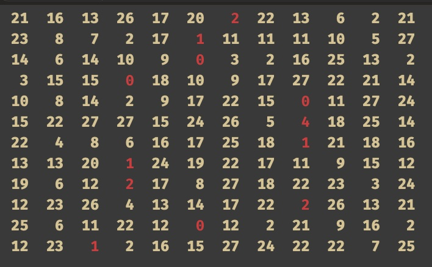
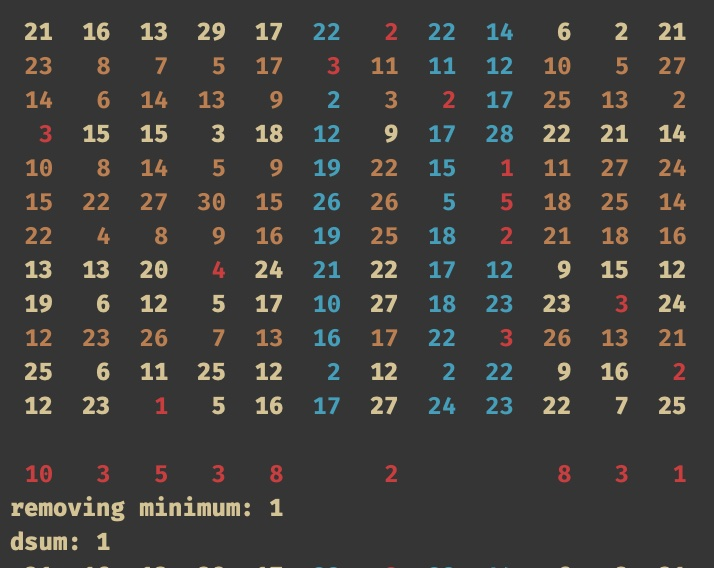
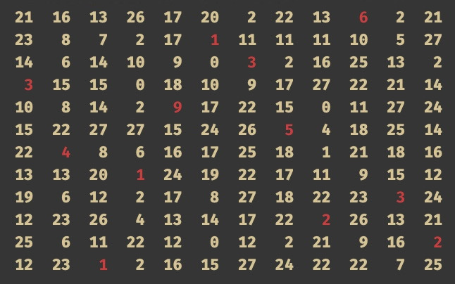

# Mack's algorithm
Traditionally the hungarian algorithm is used to solve the assigment problem. Later on, more efficient or simpler algorithms were deviced such as Mack's algorithm. This is a swift implementation of this algorithm.

More details about this algorithm can be found in [this pdf](https://web.eecs.umich.edu/~pettie/matching/Jonker-Volgenant-teaching-Macks-Bradford-method.pdf).

This is an example how to program works. Suppose the following 12x12 cost matrix is given:

(in red are the obvious minimums per row)

Then the algorithm will output all intermediate results like this:

And eventually will output the following optimal assigment:

To see the colors in the console window of Xcode as shown above you'll need to install a special font called `ColoredConsole-Bold.ttf`. You can download this font and find instruction on how to install it in Xcode on this [github repo](https://github.com/jjrscott/ColoredConsole).
