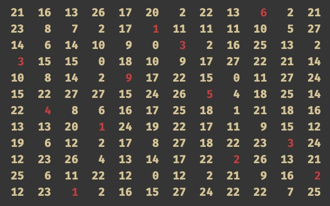

# Mack's algorithm
Traditionally the hungarian algorithm is used to solve the assigment problem. Later on, more efficient or simpler algorithms were deviced such as Mack's algorithm. This is a swift implementation of this algorithm.

More details about this algorithm can be found in [this pdf](https://web.eecs.umich.edu/~pettie/matching/Jonker-Volgenant-teaching-Macks-Bradford-method.pdf).

This is an example how to program works. Suppose the following 12x12 cost matrix is given:

```text
 21  16  13  26  17  20  ︆ ︆2︆ ︆ 22  13   6   2  21 
 23   8   7   2  17  ︆ ︆1︆ ︆ 11  11  11  10   5  27 
 14   6  14  10   9  ︆ ︆0︆ ︆  3   2  16  25  13   2 
  3  15  15  ︆ ︆0︆ ︆ 18  10   9  17  27  22  21  14 
 10   8  14   2   9  17  22  15  ︆ ︆0︆ ︆ 11  27  24 
 15  22  27  27  15  24  26   5  ︆ ︆4︆ ︆ 18  25  14 
 22   4   8   6  16  17  25  18  ︆ ︆1︆ ︆ 21  18  16 
 13  13  20  ︆ ︆1︆ ︆ 24  19  22  17  11   9  15  12 
 19   6  12  ︆ ︆2︆ ︆ 17   8  27  18  22  23   3  24 
 12  23  26   4  13  14  17  22  ︆ ︆2︆ ︆ 26  13  21 
 25   6  11  22  12  ︆ ︆0︆ ︆ 12   2  21   9  16   2 
 12  23  ︆ ︆1︆ ︆  2  16  15  27  24  22  22   7  25 
```

Then the algorithm will eventually output the following optimal assigment:



To see the colors in the console window of XCode as shown above you'll need to install a special font called `ColoredConsole-Bold.ttf`. You can download this font and instruction on how to install it in XCode on this [github repo](https://github.com/jjrscott/ColoredConsole).
